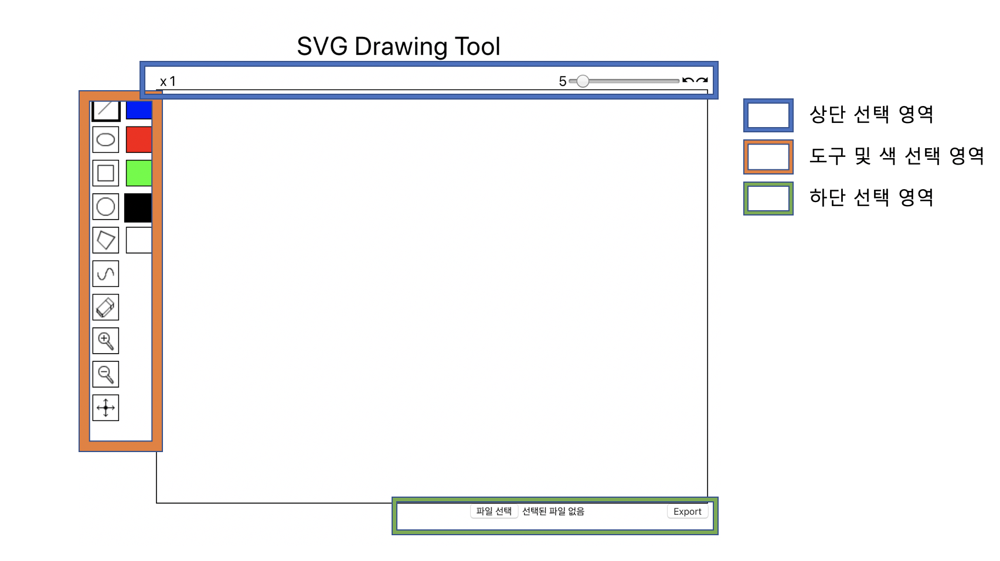

# SVG Drawing Tool

## 사용 기술 및 라이브러리

create-react-app  
svg  
redux  
redux-action  
svgson

## 시작 방법

```
yarn install
yarn start
```

## 화면 및 구역 설명



## 메뉴얼

### 도구 및 색 선택 영역

#### 도구 선택 영역


직선을 그리는 도구  
화면상의 한 점을 클릭 후 다른 지점을 클릭하면 양 끝단의 직선이 생긴다.


타원을 그리는 도구  
화면상의 한 점을 클릭 후 다른 지점을 클릭하면 시작 위치와 끝 위치에 가득 채워지는 타원이 그려진다.


사각형을 그리는 도구  
화면상의 한 점을 클릭 후 다른 지점을 클릭하면 시작 위치와 끝 위치에 가득 채워지는 사각형이 그려진다.


원을 그리는 도구  
화면상의 한 점을 클릭 후 다른 지점을 클릭하면 시작위치를 중앙으로하고 끝 위치를 지름 거리로 하는 원이 생성된다.


다각형을 그리는 도구  
화면상의 한 점을 클릭 후 다른 지점을 클릭할 때마다 각 지점을 꼭지점으로 하는 다각형이 생긴다. """우클릭"""을 하면 다각형 그리기가 종료된다.


자유로운 스트로크를 위한 도구  
화면의 아무지점을 클릭 후 드래그를하면 드래그 하는 방향대로 자유로운 스트로크를 할 수 있다.


지우개  
지우개를 선택한 후 그려진 오브젝트의 위를 지나가면 오브젝트를 삭제할 수 있다.


Zoomin  
Zoomin을 선택한 후 화면을 클릭하면, 오브젝트의 크기가 두 배 씩 증가한다


Zoomout  
Zoomout을 선택한 후 화면을 클릭하면, 오브젝트의 크기가 두 배 씩 감소한다


Mover  
Mover를 선택한 후 화면을 드래그 하면 원하는 위치로 캔버스를 옮길 수 있다.

#### 색 선택 영역

현재 색은 5개만 지원된다.  
'파란색', '빨간색', '녹색', '검은색', '흰색'

원하는 색을 선택 후 해당 도구에 맞는 마우스 액션을 취하면 선택한 색으로 선택한 도구의 모양이 그려지게 된다.

### 상단 선택 영역

#### 배율

현재 몇 배의 Zooming으로 개채를 보고있는지 확인할 수있다.
Default값은 1x이다.

#### 스트로크 굵기 조절 바

선택한 도구에 맞는 스트로크의 굵기를 제공한다.
Default값은 5이며 최소 1 최대 50의 값을 가진다.

#### undo/redo

undo버튼 클릭 시 과거에 작업했던 시점으로 돌아갈 수 있고
redo 버튼 클릭시 undo로 돌아왔던 만큼 다시 되돌아 갈 수 있다.

### 하단 선택 영역

#### Import

SVG파일을 Import할 수 있다.
주) SVG파일만을 읽을 수 있고 파일 체크는 하지 않기 때문에 읽을 수 있는 SVG파일만 넣어야 한다.

#### Export

작업한 SVG파일을 Export 할 수 있다.
주) 이름은 항상 newSvg.svg로 다운로드 된다.

## 권장 브라우저 및 알려진 버그 패턴

### 권장 브라우저

이 어플리케이션 은 Chrome을 기반으로 제작되었다.
